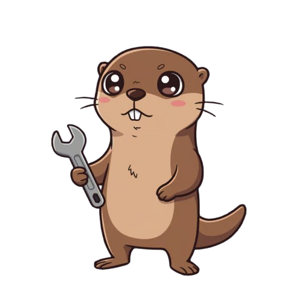

<p align="center">
  
</p>

# Otter - A Learning Interpreter in Go

Welcome to Otter! This project documents my journey building a small programming language interpreter from scratch in Go. It's been an incredible exercise in understanding what happens under the hood when code runs.

Otter's syntax has a C-like feel, aiming for simplicity to explore core interpreter concepts rather than full C compatibility.

##  Otter's Current Features (A Learner's Implementation)

*   **Basic Syntax:** `let` for variable bindings.
*   **Data Types:** Integers, Booleans, Strings. Support for Arrays and Hashes (key-value maps) is also included.
*   **Expressions:** Arithmetic (`+`, `-`, `*`, `/`) with operator precedence, and boolean logic (`!`, ` == `, `!=`, `<`, `>`).
*   **Control Flow:** `if/else` expressions.
*   **Functions:**
    *   First-class: Can be assigned to variables and passed around.
    *   Higher-order: Can accept or return other functions.
    *   **Closures:** Implemented to allow functions to remember their creation environment.
*   **Built-in Functions:** Essential utilities like `len()`, `puts()`, and basic array functions (`first`, `last`, `rest`, `push`).
*   **REPL:** An interactive shell to experiment with Otter.

*While functional for its learning purpose, Otter is a simplified language and not intended for production use.*

##  Key Learnings & Implementation Insights

This project was less about creating the next big language and more about the foundational learning:

*   **Lexical Analysis (Lexing):** Turning raw text into a stream of recognizable "tokens."
*   **Parsing (Syntactic Analysis):** Building an Abstract Syntax Tree (AST) to represent code structure. The Pratt parsing technique for expressions was a particularly enlightening part of this, an approach I familiarized myself with while working through materials like Thorsten Ball's 
*   **AST Design:** Defining Go interfaces and structs to model the language's grammar.
*   **Evaluation/Interpretation:** Recursively walking the AST to execute code. Implementing **environments** for variable scoping and the mechanics of **closures** were key challenges and big learning milestones.
*   **Error Handling:** Basic strategies for reporting issues from the lexer, parser, and evaluator.
*   **Internal Data Representation:** Designing Go structs for Otter's simple object system.

##  Get Started with Otter

1.  Clone this repository.
2.  In the project directory, run: `go run main.go`
3.  The Otter REPL will start!

```
Hello [Your Username]! This is the Otter programming language!
Feel free to type in commands
>> let greet = fn(name) { "Hello, " + name + "!" };
>> puts(greet("Otter"));
Hello, Otter!
null
>>
```

##  Project Structure

*   `/token`: Defines Otter's lexical tokens.
*   `/lexer`: The lexical analyzer.
*   `/ast`: Abstract Syntax Tree node definitions.
*   `/parser`: The syntactic analyzer (parser).
*   `/object`: Otter's internal object system.
*   `/evaluator`: The tree-walking evaluator.
*   `/repl`: The interactive REPL.
*   `main.go`: Main application entry point.

